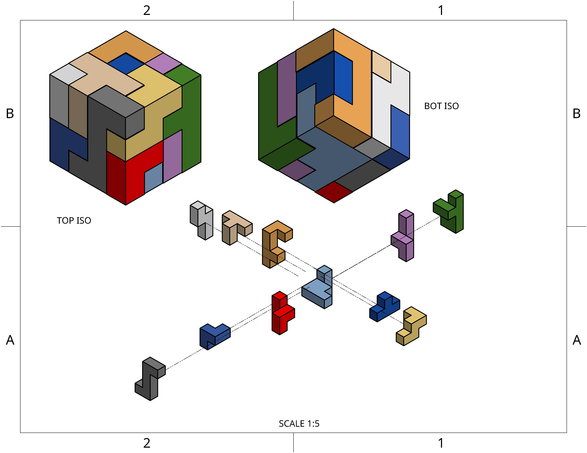

# Cube-Solver
Solves a physical cube puzzle using a backtracking algorithm.

## The Cube
The "Mega Cube" is the title given to the entire puzzle as a whole. This cube is comprised of dim^3 "Mini Cubes", where dim is the side length of the cube. These Mini Cubes are grouped together into various "parts". The Mini Cubes within a part must stay locked together but can be rotated and moved as a unit. The Mega Cube is solved when the parts are arranged in such a way that they stay in the bounds of the cube.
### Mega Cube
The Mega Cube is represented by a 3D dim x dim x dim list. All values in this list are initialized to 0. Each Mega Cube also contains a list of parts that can be used to construct the Mega Cube

### Parts/Mini Cubes
Each part is represented by a list of orientations. Each of these orientations is a different combination of 3 entry tuples (each tuple is a Mini Cube). These tuples are defined from special Mini Cube called the Origin Mini Cube. All parts have their own Origin Mini Cube, and the original orientation is created from this Mini Cube. 

All tuples in each orientation represent the (x, y, z) location of a Mini Cube within the part defined in relationship to the Origin Mini Cube. This allows us to use linear transformations to rotate each piece around its Origin Mini Cube and store all of its possible orientations.

Additionally, each part is assigned a part number for easy identification when reading output/solution.

## The Algorithm

### Preparation
Once all pieces have been entered successfully, you can run the program. The initial setup will create the Mega Cube 3D list, followed by instantiating all parts into the parts list. Upon instantiation, each part will calculate all orientations. This process results in repeated orientations (because I didn't think through the symmetry issues and over rotating), meaning the list must be parsed and the repeats must be removed. After all parts have been instantiated, the parts list is then sorted by descending size (more Mini Cubes means lower index).

### Backtracking Algorithm
Following preparation, the backtracking algorithm begins. This is an informed brute force algorithm that takes quite a while to run. To begin, the starting piece's first orientation's origin is "placed" at the Mega Cube's origin. The rest of the part's Mini Cubes are then checked to see if they are in bounds (and for future pieces, not overlapping with another piece). if the placement is invalid, the piece is "rotated" to it's next orientation and the validity is tested again. If all orientations fail to fit in this location, the piece's Origin Mini Cube is moved to the next space over and the process is repeated until all location-orientation combinations are tested for this piece given the previous piece placement. 

If no valid location-orientaion combination is found, the algorithm backtracks to the last piece placed and continues the crawl for a new valid placement for said piece. 

Should a valid location-orientation combination be found, the piece will be preemptively placed. This means that the Mega Cube list representation's values that correspond to the location of all Mini Cubes in the part will be changed from 0s to the part's part number. The Algorithm then moves on to the next piece repeats the crawl process with that piece.

When all pieces have been placed, the Mega Cube has finished construction, and the puzzle is completed.

## Efficiency

This is not a very efficient algorithm to begin with, and there are added redundancies that amplify this problem.

### Current Efficiency Changes (Time)
| Description | Implemented | Estimated Impact |
| :---: | :---: | :---: | 
| Removal of Repeated Orientations | Yes | Minor |
| Sorting of Parts by Size | Yes | Moderate |
| Not Creating Repeated Orientations | No | Minor |
| Fewer Redundant Orientation Checks | No | Moderate-Major |

### Visual Example
